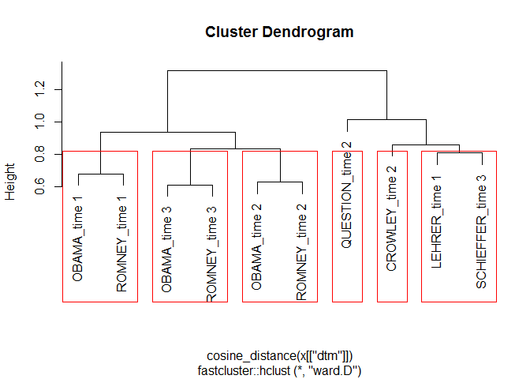
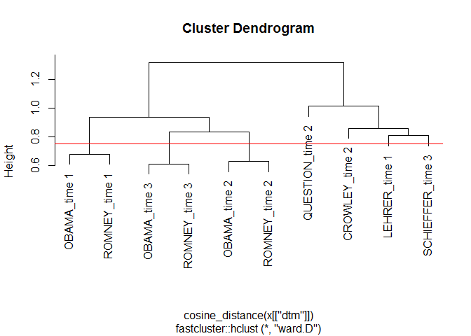
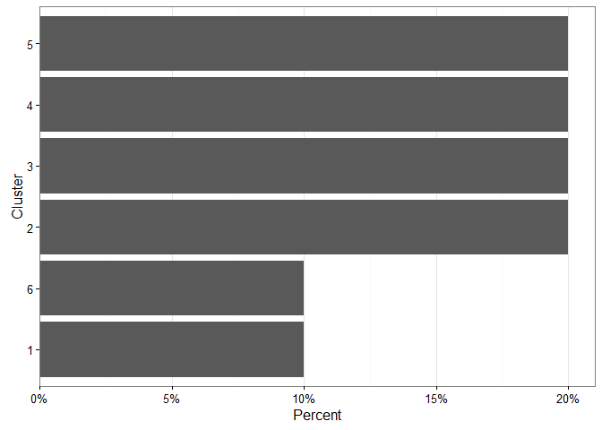
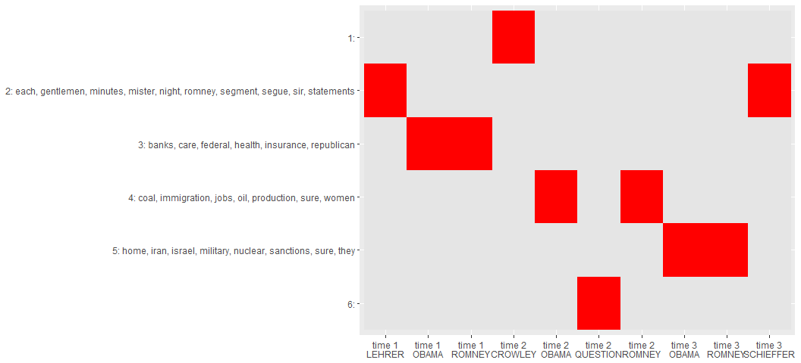
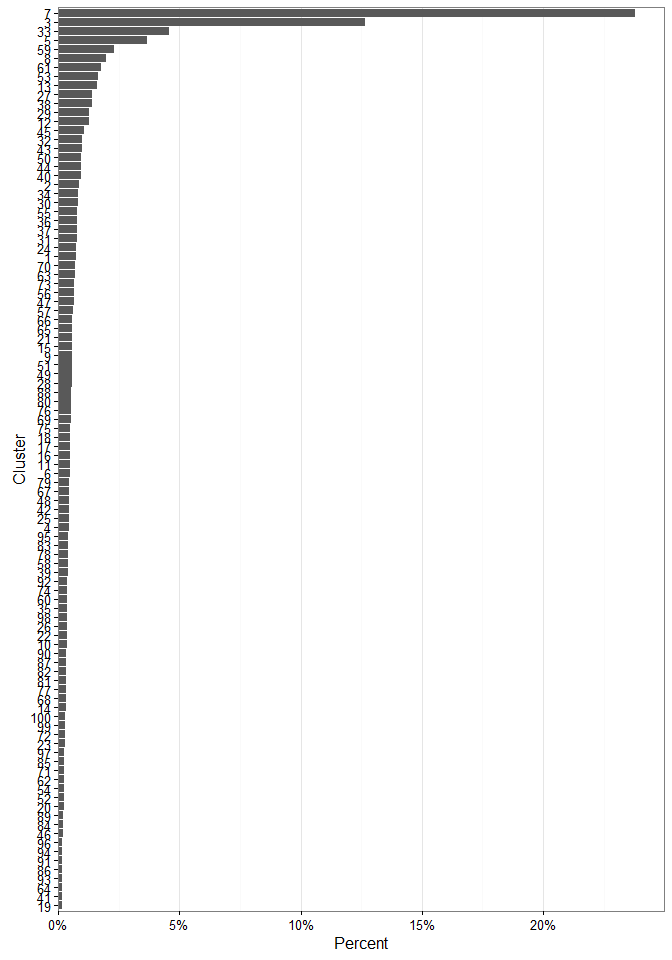
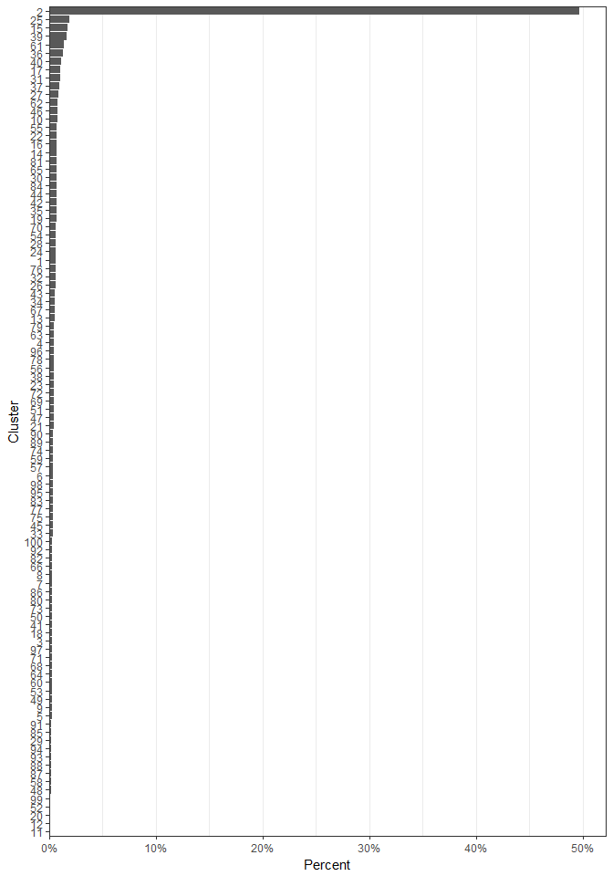
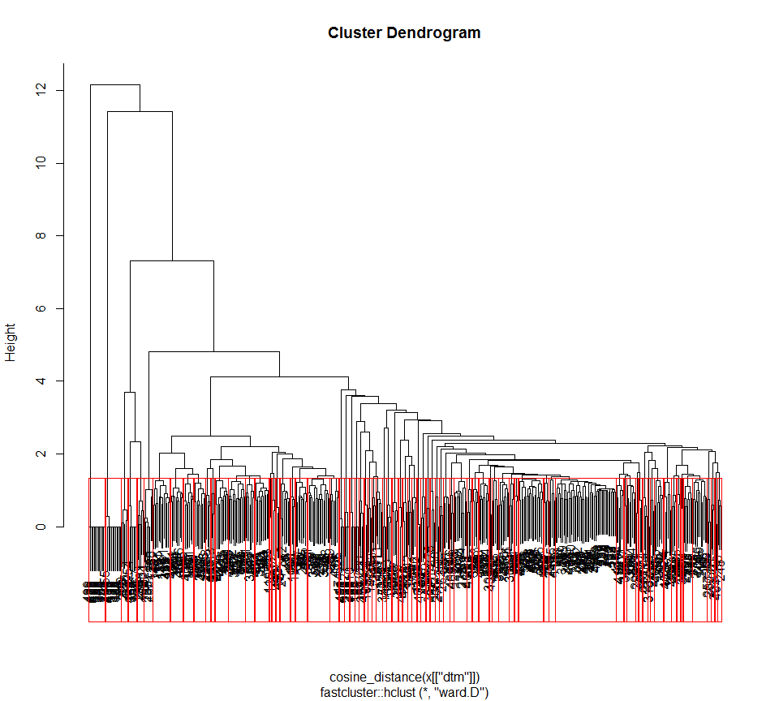
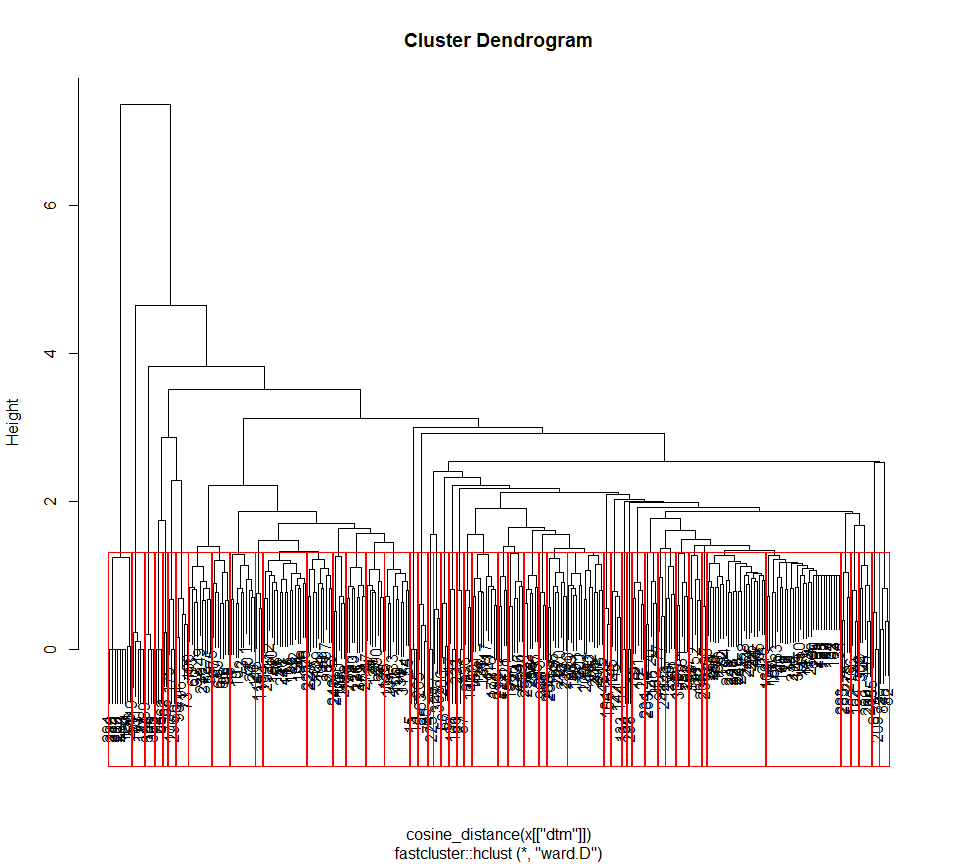
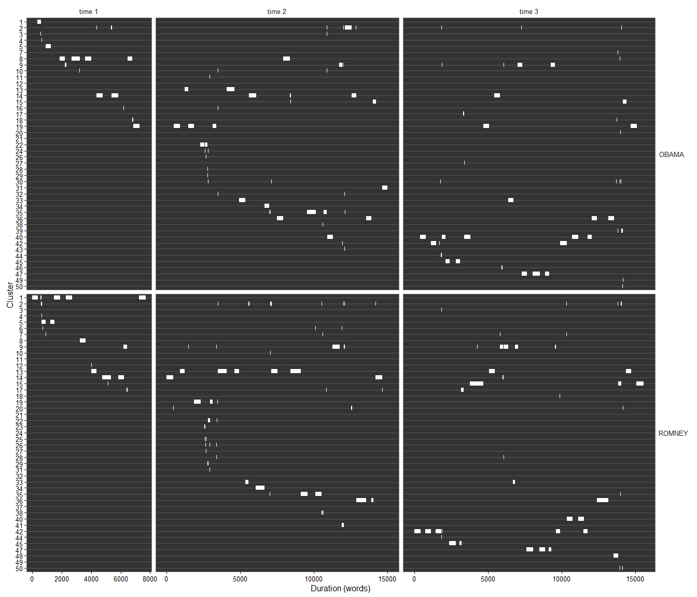

clustext   
============

**clustext** is a collection of optimized tools for clustering text data
via various text appropriate clustering algorithms. There are many great
R [clustering tools](https://cran.r-project.org/web/views/Cluster.html)
to locate topics within documents. I have had success with hierarchical
clustering for topic extraction. This initial success birthed the
[**hclustext**](https://github.com/trinker/hclustext) package.
Additional techniques such as kmeans and non-negative matrix
factorization also proved useful. These algorithms began to be collected
in a consistent manor of use in the **clustext** package. This package
wraps many of the great R tools for clustering and working with sparse
matrices to aide in the workflow associated with topic extraction.

The general idea is that we turn the documents into a matrix of words.
After this we weight the terms by importance using
[tf-idf](http://nlp.stanford.edu/IR-book/html/htmledition/tf-idf-weighting-1.html).
This helps the more salient words to rise to the top. Some clustering
algorithms require a similarity matrix while others require just the
tf-idf weighted DocumentTermMatrices. Likewise, some algorithms require
`k` terms to be specified before the model fit while others allow `k`
topics to be determined after the model has been fit.

With algorithms that require a similarity matrix (e.g., hierarchical
clustering) we apply cosine distance measures to compare the terms (or
features) of each document. I have found cosine distance to work well
with sparse matrices to produce distances metrics between the documents.
The clustering model is fit to separate the documents into clusters. In
the case of some clustering techniques (e.g., hierarchical clustering)
the user then may apply k clusters to the fit, clustering documents with
similar important text features. Other techniques require that `k` be
specified prior to fitting the model. The documents can then be grouped
by clusters and their accompanying salient words extracted as well.

Table of Contents
============

-   [Functions](#functions)
-   [Installation](#installation)
-   [Contact](#contact)
-   [Demonstration](#demonstration)
    -   [Load Packages and Data](#load-packages-and-data)
    -   [Data Structure](#data-structure)
    -   [Fit the Model: Hierarchical Cluster](#fit-the-model-hierarchical-cluster)
    -   [Assigning Clusters](#assigning-clusters)
        -   [Cluster Loading](#cluster-loading)
        -   [Cluster Text](#cluster-text)
        -   [Cluster Frequent Terms](#cluster-frequent-terms)
        -   [Clusters, Terms, and Docs Plot](#clusters-terms-and-docs-plot)
        -   [Cluster Documents](#cluster-documents)
    -   [Putting it Together](#putting-it-together)
    -   [An Experiment](#an-experiment)

Functions
============

The main functions, task category, & descriptions are summarized in the
table below:

<table style="width:161%;">
<colgroup>
<col width="34%" />
<col width="23%" />
<col width="102%" />
</colgroup>
<thead>
<tr class="header">
<th align="left">Function</th>
<th align="left">Category</th>
<th align="left">Description</th>
</tr>
</thead>
<tbody>
<tr class="odd">
<td align="left"><code>data_store</code></td>
<td align="left">data structure</td>
<td align="left"><strong>clustext</strong>'s data structure (list of dtm + text)</td>
</tr>
<tr class="even">
<td align="left"><code>hierarchical_cluster</code></td>
<td align="left">cluster fit</td>
<td align="left">Fits a hierarchical cluster model</td>
</tr>
<tr class="odd">
<td align="left"><code>kmeans_cluster</code></td>
<td align="left">cluster fit</td>
<td align="left">Fits a kmeans cluster model</td>
</tr>
<tr class="even">
<td align="left"><code>skmeans_cluster</code></td>
<td align="left">cluster fit</td>
<td align="left">Fits an skmeans cluster model</td>
</tr>
<tr class="odd">
<td align="left"><code>nfm_cluster</code></td>
<td align="left">cluster fit</td>
<td align="left">Fits a non-negative matrix factorization cluster model</td>
</tr>
<tr class="even">
<td align="left"><code>assign_cluster</code></td>
<td align="left">assignment</td>
<td align="left">Assigns cluster to document/text element</td>
</tr>
<tr class="odd">
<td align="left"><code>get_text</code></td>
<td align="left">extraction</td>
<td align="left">Get text from various <strong>clustext</strong> objects</td>
</tr>
<tr class="even">
<td align="left"><code>get_dtm</code></td>
<td align="left">extraction</td>
<td align="left">Get <code>tm::DocumentTermMatrix</code> from various <strong>clustext</strong> objects</td>
</tr>
<tr class="odd">
<td align="left"><code>get_removed</code></td>
<td align="left">extraction</td>
<td align="left">Get removed text elements from various <strong>clustext</strong> objects</td>
</tr>
<tr class="even">
<td align="left"><code>get_terms</code></td>
<td align="left">extraction</td>
<td align="left">Get clustered weighted important terms from an <strong>assign_cluster</strong> object</td>
</tr>
<tr class="odd">
<td align="left"><code>get_documents</code></td>
<td align="left">extraction</td>
<td align="left">Get clustered documents from an <strong>assign_cluster</strong> object</td>
</tr>
</tbody>
</table>

Installation
============

To download the development version of **clustext**:

Download the [zip
ball](https://github.com/trinker/clustext/zipball/master) or [tar
ball](https://github.com/trinker/clustext/tarball/master), decompress
and run `R CMD INSTALL` on it, or use the **pacman** package to install
the development version:

    if (!require("pacman")) install.packages("pacman")
    pacman::p_load_gh(
        "trinker/textshape", 
        "trinker/gofastr", 
        "trinker/termco",    
        "trinker/clustext"
    )

Contact
=======

You are welcome to:    
- submit suggestions and bug-reports at: <https://github.com/trinker/clustext/issues>    
- send a pull request on: <https://github.com/trinker/clustext/>    
- compose a friendly e-mail to: <tyler.rinker@gmail.com>    

Demonstration
=============

Load Packages and Data
----------------------

    if (!require("pacman")) install.packages("pacman")
    pacman::p_load(clustext, dplyr, textshape, ggplot2, tidyr)

    data(presidential_debates_2012)

Data Structure
--------------

The data structure for **clustext** is very specific. The `data_storage`
produces a `DocumentTermMatrix` which maps to the original text. The
empty/removed documents are tracked within this data structure, making
subsequent calls to cluster the original documents and produce weighted
important terms more robust. Making the `data_storage` object is the
first step to analysis.

We can give the `DocumentTermMatrix` rownames via the `doc.names`
argument. If these names are not unique they will be combined into a
single document as seen below. Also, if you want to do stemming, minimum
character length, stopword removal or such this is when/where it's done.

    ds <- with(
        presidential_debates_2012,
        data_store(dialogue, doc.names = paste(person, time, sep = "_"))
    )

    ds

    ## <<Data Store (documents: 10, terms: 3,180)>>
    ## Text Elements      : 10
    ## Elements Removed   : 0
    ## Non-/sparse entries: 6916/24884
    ## Sparsity           : 78%
    ## Maximal term length: 16
    ## Minimum term length: 3

Fit the Model: Hierarchical Cluster
-----------------------------------

Next we can fit a hierarchical cluster model to the `data_store` object
via `hierarchical_cluster`.

    myfit <- hierarchical_cluster(ds)

    myfit

    ## 
    ## Call:
    ## fastcluster::hclust(d = cosine_distance(x[["dtm"]]), method = method)
    ## 
    ## Cluster method   : ward.D 
    ## Number of objects: 10

This object can be plotted with various `k` or `h` parameters specified
to experiment with cutting the dendrogram. This cut will determine the
number of clusters or topics that will be generated in the next step.
The visual inspection allows for determining how to cluster the data as
well as determining if a tf-idf, cosine, hierarchical cluster model is a
right fit for the data and task. By default `plot` uses an approximation
of `k` based on Can & Ozkarahan's (1990) formula (*m* \* *n*)/*t* where
*m* and *n* are the dimensions of the matrix and *t* is the length of
the non-zero elements in matrix *A*.

-   Can, F., Ozkarahan, E. A. (1990). Concepts and effectiveness of the
    cover-coefficient-based clustering methodology for text databases.
    *ACM Transactions on Database Systems 15* (4): 483.
    <doi:10.1145/99935.99938>

Interestingly, in the plots below where `k = 6` clusters, the model
groups each of the candidates together at each of the debate times.

    plot(myfit)

    ## 
    ## k approximated to: 5

    plot(myfit, k=6)

    plot(myfit, h = .75)

Assigning Clusters
------------------

The `assign_cluster` function allows the user to dictate the number of
clusters. Because the model has already been fit the cluster assignment
is merely selecting the branches from the dendrogram, and is thus very
quick. Unlike many clustering techniques the number of clusters is done
after the model is fit, this allows for speedy cluster assignment,
meaning the user can experiment with the number of clusters.

    ca <- assign_cluster(myfit, k = 6)

    ca

    ##   CROWLEY_time 2    LEHRER_time 1     OBAMA_time 1     OBAMA_time 2 
    ##                1                2                3                4 
    ##     OBAMA_time 3  QUESTION_time 2    ROMNEY_time 1    ROMNEY_time 2 
    ##                5                6                3                4 
    ##    ROMNEY_time 3 SCHIEFFER_time 3 
    ##                5                2

### Cluster Loading

To check the number of documents loading on a cluster there is a
`summary` method for `assign_cluster` which provides a descending data
frame of clusters and counts. Additionally, a horizontal bar plot shows
the document loadings on each cluster.

    summary(ca)

    ##   cluster count
    ## 1       2     2
    ## 2       3     2
    ## 3       4     2
    ## 4       5     2
    ## 5       1     1
    ## 6       6     1

### Cluster Text

The user can grab the texts from the original documents grouped by
cluster using the `get_text` function. Here I demo a 40 character
substring of the document texts.

    get_text(ca) %>%
        lapply(substring, 1, 40)

    ## $`1`
    ## [1] "Good evening from Hofstra University in "
    ## 
    ## $`2`
    ## [1] "We'll talk about specifically about heal"
    ## [2] "Good evening from the campus of Lynn Uni"
    ## 
    ## $`3`
    ## [1] "Jim, if I if I can just respond very qui"
    ## [2] "What I support is no change for current "
    ## 
    ## $`4`
    ## [1] "Jeremy, first of all, your future is bri"
    ## [2] "Thank you, Jeremy. I appreciate your you"
    ## 
    ## $`5`
    ## [1] "Well, my first job as commander in chief"
    ## [2] "Thank you, Bob. And thank you for agreei"
    ## 
    ## $`6`
    ## [1] "Mister President, Governor Romney, as a "

### Cluster Frequent Terms

As with many topic clustering techniques, it is useful to get the to
salient terms from the model. The `get_terms` function uses the
[min-max](https://en.wikipedia.org/wiki/Feature_scaling#Rescaling)
scaled, [tf-idf weighted](https://en.wikipedia.org/wiki/Tf%E2%80%93idf),
`DocumentTermMatrix` to extract the most frequent salient terms. These
terms can give a sense of the topic being discussed. Notice the absence
of clusters 1 & 6. This is a result of only a single document included
in each of the clusters. The `term.cutoff` hyperparmeter sets the lower
bound on the min-max scaled tf-idf to accept. If you don't get any terms
you may want to lower this or reduce `min.n`. Likewise, these two
parameters can be raised to eliminate noise.

    get_terms(ca)

    ## $`1 (n=1)`
    ##         term    weight
    ## 1     mister 1.0000000
    ## 2      along 0.7086841
    ## 3       sort 0.6678306
    ## 4 unemployed 0.6223915
    ## 
    ## $`2 (n=2)`
    ##      term    weight
    ## 1 segment 1.0000000
    ## 2 minutes 0.9091730
    ## 3  minute 0.6648988
    ## 
    ## $`3 (n=2)`
    ##        term    weight
    ## 1 insurance 1.0000000
    ## 2    health 0.6200389
    ## 
    ## $`4 (n=2)`
    ##           term    weight
    ## 1         coal 1.0000000
    ## 2         jobs 0.9439400
    ## 3         sure 0.9330092
    ## 4  immigration 0.9134630
    ## 5          oil 0.9014907
    ## 6        issue 0.7352300
    ## 7        candy 0.7303597
    ## 8   production 0.7291683
    ## 9        women 0.7073096
    ## 10     million 0.6792076
    ## 11      settle 0.6056192
    ## 12   illegally 0.6055244
    ## 
    ## $`5 (n=2)`
    ##         term    weight
    ## 1    nuclear 1.0000000
    ## 2       iran 0.9511527
    ## 3  sanctions 0.8585336
    ## 4     israel 0.7895173
    ## 5       sure 0.7698270
    ## 6     region 0.7608304
    ## 7   military 0.7272537
    ## 8     troops 0.6768143
    ## 9   pakistan 0.6766784
    ## 10     world 0.6716568
    ## 11    threat 0.6520238
    ## 12      iraq 0.6467488
    ## 
    ## $`6 (n=1)`
    ##            term    weight
    ## 1    department 1.0000000
    ## 2           chu 0.6666667
    ## 3        stated 0.6666667
    ## 4 misperception 0.6666667

### Clusters, Terms, and Docs Plot

Here I plot the clusters, terms, and documents (grouping variables)
together as a combined heatmap. This can be useful for viewing &
comparing what documents are clustering together in the context of the
cluster's salient terms. This example also shows how to use the cluster
terms as a lookup key to extract probable salient terms for a given
document.

    key <- data_frame(
        cluster = 1:6,
        labs = get_terms(ca) %>%
            bind_list("cluster") %>%
            select(-weight) %>%
            group_by(cluster) %>%
            summarize(term=paste(term, collapse=", ")) %>%
            apply(1, paste, collapse=": ")
    )

    ca %>%
        bind_vector("id", "cluster") %>%
        separate(id, c("person", "time"), sep="_") %>%
        tbl_df() %>%
        left_join(key) %>%
        mutate(n = 1) %>%
        mutate(labs = factor(labs, levels=rev(key[["labs"]]))) %>%
        unite("time_person", time, person, sep="\n") %>%
        select(-cluster) %>%
        complete(time_person, labs) %>%  
        mutate(n = factor(ifelse(is.na(n), FALSE, TRUE))) %>%
        ggplot(aes(time_person, labs, fill = n)) +
            geom_tile() +
            scale_fill_manual(values=c("grey90", "red"), guide=FALSE) +
            labs(x=NULL, y=NULL) 

    ## Joining by: "cluster"

### Cluster Documents

The `get_documents` function grabs the documents associated with a
particular cluster. This is most useful in cases where the number of
documents is small and they have been given names.

    get_documents(ca)

    ## $`1`
    ## [1] "CROWLEY_time 2"
    ## 
    ## $`2`
    ## [1] "LEHRER_time 1"    "SCHIEFFER_time 3"
    ## 
    ## $`3`
    ## [1] "OBAMA_time 1"  "ROMNEY_time 1"
    ## 
    ## $`4`
    ## [1] "OBAMA_time 2"  "ROMNEY_time 2"
    ## 
    ## $`5`
    ## [1] "OBAMA_time 3"  "ROMNEY_time 3"
    ## 
    ## $`6`
    ## [1] "QUESTION_time 2"

Putting it Together
-------------------

I like working in a chain. In the setup below we work within a
**magrittr** pipeline to fit a model, select clusters, and examine the
results. In this example I do not condense the 2012 Presidential Debates
data by speaker and time, rather leaving every sentence as a separate
document. On my machine the initial `data_store` and model fit take ~5-8
seconds to run. Note that I do restrict the number of clusters (for
texts and terms) to a random 5 clusters for the sake of space.

    .tic <- Sys.time()

    myfit2 <- presidential_debates_2012 %>%
        with(data_store(dialogue)) %>%
        hierarchical_cluster()

    difftime(Sys.time(), .tic)

    ## Time difference of 5.081183 secs

    ## View Document Loadings
    ca2 <- assign_cluster(myfit2, k = 100)
    summary(ca2) %>% 
        head(12)

    ##    cluster count
    ## 1        2  1409
    ## 2       25    54
    ## 3       15    50
    ## 4       39    46
    ## 5       61    39
    ## 6       36    37
    ## 7       40    33
    ## 8       17    31
    ## 9       31    29
    ## 10      37    28
    ## 11      27    25
    ## 12      46    23

    ## Split Text into Clusters
    set.seed(5); inds <- sort(sample.int(100, 5))

    get_text(ca2)[inds] %>%
        lapply(head, 10)

    ## $`11`
    ## [1] "Yeah, we're going to yeah, I want to get to it."
    ## [2] "And do you yeah."                               
    ## [3] "Yeah, you bet."                                 
    ## [4] "Yeah."                                          
    ## 
    ## $`21`
    ##  [1] "Regulation is essential."                                                                                                                                 
    ##  [2] "You can't have a free market work if you don't have regulation."                                                                                          
    ##  [3] "Every free economy has good regulation."                                                                                                                  
    ##  [4] "You have to have regulation."                                                                                                                             
    ##  [5] "Now, it wasn't just on Wall Street."                                                                                                                      
    ##  [6] "We stepped in and had the toughest reforms on Wall Street since the one thousand nine hundred thirtys."                                                   
    ##  [7] "And so the question is: Does anybody out there think that the big problem we had is that there was too much oversight and regulation of Wall Street?"     
    ##  [8] "Look, we have to have regulation on Wall Street."                                                                                                         
    ##  [9] "That's why I'd have regulation."                                                                                                                          
    ## [10] "I committed that I would rein in the excesses of Wall Street, and we passed the toughest Wall Street reforms since the one thousand nine hundred thirtys."
    ## 
    ## $`28`
    ##  [1] "We said you've got banks, you've got to raise your capital requirements."               
    ##  [2] "Well, actually it's it's it's a lengthy description."                                   
    ##  [3] "Well, actually Governor, that isn't what your plan does."                               
    ##  [4] "Number two, we've got to make sure that we have the best education system in the world."
    ##  [5] "We've got to reduce our deficit, but we've got to do it in a balanced way."             
    ##  [6] "I got to I got to move you on."                                                         
    ##  [7] "He actually got|"                                                                       
    ##  [8] "He actually got the first question."                                                    
    ##  [9] "Governor Romney, I'm sure you've got a reply there."                                    
    ## [10] "I've got to say|"                                                                       
    ## 
    ## $`68`
    ## [1] "That's how we went after Al Qaida and bin Laden."                                                 
    ## [2] "I said that we'd go after al Qaeda and bin Laden, we have."                                       
    ## [3] "I congratulate him on on taking out Osama bin Laden and going after the leadership in al Qaeda."  
    ## [4] "When it comes to going after Osama bin Laden, you said, well, any president would make that call."
    ## [5] "And she said to me, You know, by finally getting bin Laden, that brought some closure to me."     
    ## [6] "We had to go in there to get Osama bin Laden."                                                    
    ## [7] "Well, keep in mind our strategy wasn't just going after bin Laden."                               
    ## 
    ## $`90`
    ##  [1] "And finally, championing small business."                                                                                                                                              
    ##  [2] "And then let's take the last one, championing small business."                                                                                                                         
    ##  [3] "I came through small business."                                                                                                                                                        
    ##  [4] "I understand how hard it is to start a small business."                                                                                                                                
    ##  [5] "I want to keep their taxes down on small business."                                                                                                                                    
    ##  [6] "So if you're starting a business, where would you rather start it?"                                                                                                                    
    ##  [7] "But, of course, if you're a small business or a mom and pop business or a big business starting up here, you've got to pay even the reduced rate that Governor Romney's talking about."
    ##  [8] "And finally, number five, we've got to champion small business."                                                                                                                       
    ##  [9] "Small business is where jobs come from."                                                                                                                                               
    ## [10] "That's not the kind of small business promotion we need."

    ## Get Associated Terms
    get_terms(ca2, .4)[inds]

    ## $`11`
    ##   term weight
    ## 1 yeah      1
    ## 
    ## $`21`
    ##         term weight
    ## 1 regulation      1
    ## 
    ## $`28`
    ##       term    weight
    ## 1      got 1.0000000
    ## 2 actually 0.5421049
    ## 
    ## $`68`
    ##    term   weight
    ## 1   bin 1.000000
    ## 2 laden 1.000000
    ## 3 osama 0.449873
    ## 
    ## $`90`
    ##       term   weight
    ## 1 business 1.000000
    ## 2    small 0.679014

An Experiment
-------------

It seems to me that if the hierarchical clustering is function as
expected we'd see topics clustering together within a conversation as
the natural eb and flow of a conversation is to talk around a topic for
a while and then move on to the next related topic. A Gantt style plot
of topics across time seems like an excellent way to observe clustering
across time. In the experiment I first ran the hierarchical clustering
at the sentence level for all participants in the 2012 presidential
debates data set. I then decided to use turn of talk as the unit of
analysis. Finally, I pulled out the two candidates (President Obama and
Romney) and faceted n their topic use over time.

    if (!require("pacman")) install.packages("pacman")
    pacman::p_load(dplyr, clustext, textshape, ggplot2, stringi)

    myfit3 <- presidential_debates_2012 %>%
        mutate(tot = gsub("\\..+$", "", tot)) %>%
        with(data_store(dialogue)) %>%
        hierarchical_cluster()

    plot(myfit3, 75)

Can & Ozkarahan's (1990) formula indicated a `k = 259`. This umber
seemed overly large. I used `k = 75` for the number of topics as it
seemed unreasonable that there'd be more topics than this but with
`k = 75` over half of the sentences loaded on one cluster. Note the use
of the `attribute` `join` from `assign_cluster` to make joining back to
the original data set easier.

    k <- 75
    ca3 <- assign_cluster(myfit3, k = k)

    presidential_debates_2012 %>%
        mutate(tot = gsub("\\..+$", "", tot)) %>%
        tbl_df() %>%
        attributes(ca3)$join() %>% 
        group_by(time) %>%
        mutate(
            word_count = stringi::stri_count_words(dialogue),
            start = starts(word_count),
            end = ends(word_count)
        ) %>%
        na.omit() %>%
        mutate(cluster = factor(cluster, levels = k:1)) %>%
        ggplot2::ggplot(ggplot2::aes(x = start-2, y = cluster, xend = end+2, yend = cluster)) +
            ggplot2::geom_segment(ggplot2::aes(position="dodge"), color = 'white', size = 3) +
            ggplot2::theme_bw() +
            ggplot2::theme(panel.background = ggplot2::element_rect(fill = 'grey20'),
                panel.grid.minor.x = ggplot2::element_blank(),
                panel.grid.major.x = ggplot2::element_blank(),
                panel.grid.minor.y = ggplot2::element_blank(),
                panel.grid.major.y = ggplot2::element_line(color = 'grey35'),
                strip.text.y = ggplot2::element_text(angle=0, hjust = 0),
                strip.background = ggplot2::element_blank())  +
                ggplot2::facet_wrap(~time, scales='free', ncol=1) +
                ggplot2::labs(x="Duration (words)", y="Cluster")

    ## Joining by: "id_temporary"

Right away we notice that not all topics are used across all three
times. This is encouraging that the clustering is working as expected as
we'd expect some overlap in debate topics as well as some unique topics.
However, there were so many topics clustering on cluster 3 that I had to
make some decisions. I could (a) ignore this mass and essentially throw
out half the data that loaded on a single cluster, (b) increase `k` to
split up the mass loading on cluster 3, (c) change the unit of analysis.
It seemed the first option was wasteful of data and could miss
information. The second approach could lead to a model that had so many
topics it wouldn't be meaningful. The last approach seemed reasonable,
inspecting the cluster text showed that many were capturing functions of
language rather than content. For example, people use *"Oh."* to
indicate agreement. This isn't a topic but the clustering would group
sentences that use this convention together. Combining this sentence
with other sentences in the turn of talk are more likely to get the
content we're after.

Next I used the `textshape::combine` function to group turns of talk
together.

    myfit4 <- presidential_debates_2012 %>%
        mutate(tot = gsub("\\..+$", "", tot)) %>%
        textshape::combine() %>% 
        with(data_store(dialogue, stopwords = tm::stopwords("english"), min.char = 3)) %>%
        hierarchical_cluster()

    plot(myfit4, k = 80)

The distribution of turns of talk looked much more dispersed across
clusters. I used `k = 60` for the number of topics.

    k <- 80
    ca4 <- assign_cluster(myfit4, k = k)

    presidential_debates_2012 %>%
        mutate(tot = gsub("\\..+$", "", tot)) %>%
        textshape::combine() %>% 
        tbl_df() %>%
        attributes(ca4)$join() %>% 
        group_by(time) %>%
        mutate(
            word_count = stringi::stri_count_words(dialogue),
            start = starts(word_count),
            end = ends(word_count)
        ) %>%
        na.omit() %>%
        mutate(cluster = factor(cluster, levels = k:1)) %>%
        ggplot2::ggplot(ggplot2::aes(x = start-2, y = cluster, xend = end+2, yend = cluster)) +
            ggplot2::geom_segment(ggplot2::aes(position="dodge"), color = 'white', size = 3) +
            ggplot2::theme_bw() +
            ggplot2::theme(panel.background = ggplot2::element_rect(fill = 'grey20'),
                panel.grid.minor.x = ggplot2::element_blank(),
                panel.grid.major.x = ggplot2::element_blank(),
                panel.grid.minor.y = ggplot2::element_blank(),
                panel.grid.major.y = ggplot2::element_line(color = 'grey35'),
                strip.text.y = ggplot2::element_text(angle=0, hjust = 0),
                strip.background = ggplot2::element_blank())  +
                ggplot2::facet_wrap(~time, scales='free', ncol=1) +
                ggplot2::labs(x="Duration (words)", y="Cluster")

    ## Joining by: "id_temporary"

The plots looked less messy and indeed topics do appear to be clustering
around one another. I wanted to see how the primary participants, the
candidates, compared to each other in topic use.

In this last bit of analysis I filter out all participants except Obama
and Romeny and facet by participant across time.

    myfit5 <- presidential_debates_2012 %>%
        mutate(tot = gsub("\\..+$", "", tot)) %>%
        textshape::combine() %>% 
        filter(person %in% c("ROMNEY", "OBAMA")) %>%
        with(data_store(dialogue, stopwords = tm::stopwords("english"), min.char = 3)) %>%
        hierarchical_cluster()

    plot(myfit5, 50)

Based on the dendrogram, I used `k = 50` for the number of topics.

    k <- 50
    ca5 <- assign_cluster(myfit5, k = k)

    presidential_debates_2012 %>%
        mutate(tot = gsub("\\..+$", "", tot)) %>%
        textshape::combine() %>% 
        filter(person %in% c("ROMNEY", "OBAMA")) %>%
        tbl_df() %>%
        attributes(ca5)$join() %>% 
        group_by(time) %>%
        mutate(
            word_count = stringi::stri_count_words(dialogue),
            start = starts(word_count),
            end = ends(word_count)
        ) %>%
        na.omit() %>%
        mutate(cluster = factor(cluster, levels = k:1)) %>%
        ggplot2::ggplot(ggplot2::aes(x = start-10, y = cluster, xend = end+10, yend = cluster)) +
            ggplot2::geom_segment(ggplot2::aes(position="dodge"), color = 'white', size = 3) +
            ggplot2::theme_bw() +
            ggplot2::theme(panel.background = ggplot2::element_rect(fill = 'grey20'),
                panel.grid.minor.x = ggplot2::element_blank(),
                panel.grid.major.x = ggplot2::element_blank(),
                panel.grid.minor.y = ggplot2::element_blank(),
                panel.grid.major.y = ggplot2::element_line(color = 'grey35'),
                strip.text.y = ggplot2::element_text(angle=0, hjust = 0),
                strip.background = ggplot2::element_blank())  +
                ggplot2::facet_grid(person~time, scales='free', space='free') +
                ggplot2::labs(x="Duration (words)", y="Cluster")

    ## Joining by: "id_temporary"

If you're curious about the heaviest weighted tf-idf terms in each
cluster the next code chunk provides the top five weighted terms used in
each cluster. Below this I provide a bar plot of the frequencies of
clusters to help put the other information into perspective.

    invisible(Map(function(x, y){

        if (is.null(x)) {
            cat(sprintf("Cluster %s: ...\n", y))
        } else {
            m <- dplyr::top_n(x, 5, n)
            o <- paste(paste0(m[[1]], " (", round(m[[2]], 1), ")"), collapse="; ")
            cat(sprintf("Cluster %s: %s\n", y, o))       
        }

    }, get_terms(ca5, .4), names(get_terms(ca5, .4))))

    ## Cluster 1: topic (1); separate (1); medicare (0.8)
    ## Cluster 2: mary (1); kerry (0.9); barry (0.9); silliness (0.5); speech (0.4)
    ## Cluster 3: sorry (1)
    ## Cluster 4: absolutely (1)
    ## Cluster 5: regulation (1); dodd (0.5); frank (0.5)
    ## Cluster 6: yes (1)
    ## Cluster 7: bob (1); let (0.9); mention (0.4)
    ## Cluster 8: matter (1); fact (0.7)
    ## Cluster 9: gets (1); first (0.8); become (0.8); sunday (0.5); thing (0.4)
    ## Cluster 10: time (1); used (1); interrupted (0.8); issue (0.6); vitally (0.6)
    ## Cluster 11: well (1)
    ## Cluster 12: respond (1)
    ## Cluster 13: small (1); years (0.7); three (0.5); america (0.5); back (0.4)
    ## Cluster 14: government (1); forward (0.8); katherine (0.8); difference (0.5); young (0.5)
    ## Cluster 15: company (1); will (0.6)
    ## Cluster 16: great (1)
    ## Cluster 17: role (1); leadership (1); done (0.7); get (0.4)
    ## Cluster 18: damage (1); party (0.8); say (0.6)
    ## Cluster 19: energy (1); future (0.4)
    ## Cluster 20: yeah (1); good (0.6); thanks (0.5)
    ## Cluster 21: detroit (1); answer (0.4)
    ## Cluster 22: oil (1); produced (0.8); coal (0.5); bunch (0.5); whole (0.4)
    ## Cluster 23: federal (1); permits (0.8); licenses (0.7); waters (0.7); land (0.6)
    ## Cluster 24: true (1)
    ## Cluster 25: much (1); cut (1)
    ## Cluster 26: question (1)
    ## Cluster 27: right (1)
    ## Cluster 28: actually (1); got (0.5)
    ## Cluster 29: production (1)
    ## Cluster 30: governor (1)
    ## Cluster 31: believe (1)
    ## Cluster 32: candy (1)
    ## Cluster 33: balance (1); budget (0.7); spending (0.4); military (0.4)
    ## Cluster 34: women (1)
    ## Cluster 35: want (1); make (1); sure (0.9); timekeepers (0.7); immigration (0.6)
    ## Cluster 36: china (1); trade (0.5); jobs (0.4)
    ## Cluster 37: lorraine (1)
    ## Cluster 38: pension (1); looked (0.5)
    ## Cluster 39: record (1); check (0.8); gone (0.6); often (0.5)
    ## Cluster 40: pakistan (1); sure (0.6); afghanistan (0.5); nation (0.5); make (0.4)
    ## Cluster 41: terror (1); act (0.9); garden (0.8); rose (0.7); spontaneous (0.4)
    ## Cluster 42: foreign (1); troops (0.8); posture (0.7); policy (0.7); thought (0.4)
    ## Cluster 43: happy (1)
    ## Cluster 44: indicated (1)
    ## Cluster 45: syria (1); assad (0.5); remove (0.5)
    ## Cluster 46: ten (1); earlier (0.8); years (0.6); took (0.4)
    ## Cluster 47: iran (1); nuclear (0.8); sanctions (0.7); nations (0.6); israel (0.5)
    ## Cluster 48: liquidate (1); industry (0.5)
    ## Cluster 49: look (1); people (0.4); can (0.4)
    ## Cluster 50: wrong (1)

    invisible(summary(ca5))

It appears that in fact the topics do cluster within segments of time as
we'd expect. This is more apparent when turn of talk is used as the unit
of analysis (document level) rather than each sentence.